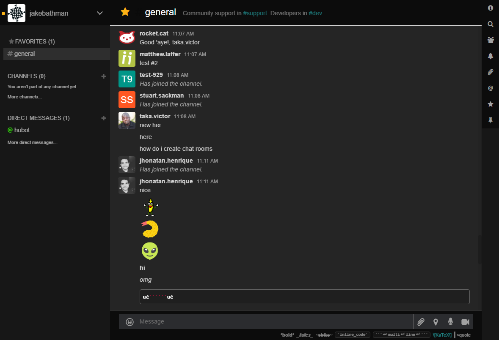

# Rocket Chat Inverted
A dark theme for Rocket Chat

## Preview

## Installing

  1. Get the Stylish addon for [Firefox](https://addons.mozilla.org/en-US/firefox/addon/2108/), [Chrome](https://chrome.google.com/extensions/detail/fjnbnpbmkenffdnngjfgmeleoegfcffe), [Opera](https://addons.opera.com/en/extensions/details/stylish/), [Safari](http://sobolev.us/stylish/) and [Firefox Mobile](https://addons.mozilla.org/en-US/firefox/addon/2108/).
  2. Then install this style using:
    * [userstyles.org](https://userstyles.org/styles/136988)
    * or, add it [manually](https://raw.githubusercontent.com/jakebathman/Rocket-Chat-Inverted/master/RocketChatInverted.css) into the editor.

## Notes

* Make sure to set your Rocket Chat domain though a `@-moz-document` rule (Firefox) or add it to the `Applies to` section in (Chrome).

## Contribute

Contributions are welcome! If you would like to contribute to this repository, please...

1. Fork
2. Make changes 
3. Create a pull request
